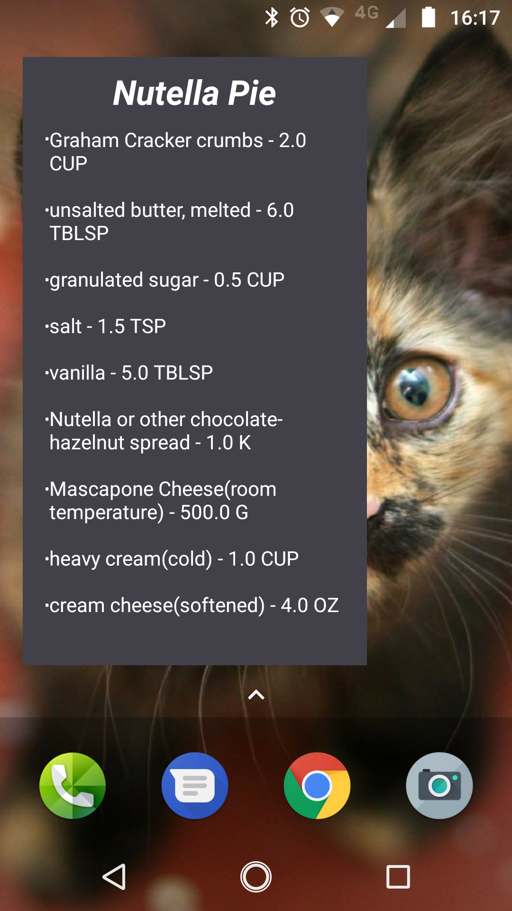

# BakingApp

Project was implemented for Android Developer Nanodegree Program from Udacity, for educational purpose only. The app has the following functionality:

* Display a list of baking recipes using RecyclerView & Glide in order to show recipes thumbnails from videos.
* Possibility to select a recipe and view Ingredients and Steps
* By tapping on a recipe Step user can visualize step instructions with video displayed using ExoPlayer
* Possibility to easily navigate through recipe steps
* Possibility to add a recipe to the Baking App home screen widget
* Display recipe details using Master-Detail flow on tablet

